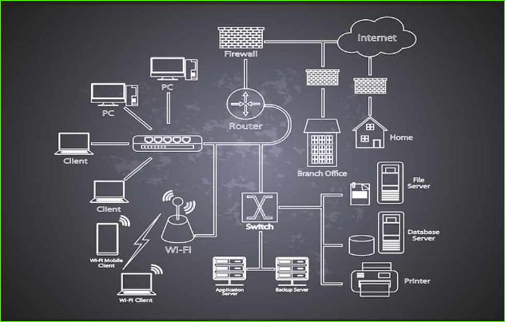
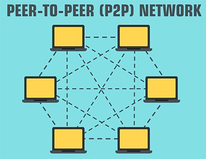

# Data Communication and Networking

## Basic Concept of Network Architecture

Network architecture is the design of a computer network. It is a framework for the specification of a network's physical components and their functional organization and configuration, its operational principles and procedures, as well as communication protocols used. It is the physical and logical design of a computer network. This framework is often represented with a diagram to provide the precise description of an established network, and the system is designed by the network architect with the help of network engineers.

### **The two types of network architecture are given below**

1. **Peer-to-peer architecture**
2. **Client/server architecture**

## Peer-to-peer architecture

Peer-to-peer architecture is a type of network layout where each device has the same capabilities and responsibilities.

### What Is Peer-to-Peer Architecture?

Peer-to-peer architecture focuses on connectivity, and each node has its own data. Every node has equal abilities, capable of requesting and responding to the services. The peer-to-peer architecture is best suited for networks that have only few number of devices for as example less than 10 devices. Otherwise, it will be very complex to maintain and costly to implement this architecture on the system.

## Client/server Architecture

Client/server architecture is a type of network layout where some devices serve others and don’t share the same capabilities and responsibilities.

### What Is Client/Server Architecture?

Client/server architecture is a model where service requesters are called clients, and service providers are called servers. They don’t have the same capabilities, as servers usually share the resources and clients don’t.
